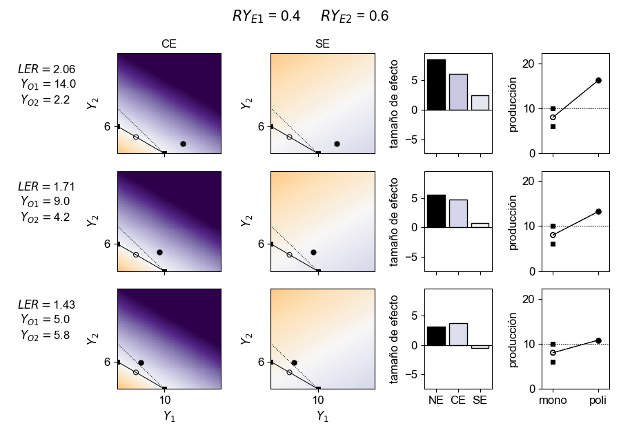

# Partición Aditiva de los Efectos de Biodiversidad

Código para graficar páneles donde se explora la relación entre la tasa equivalente de superficie (LER) y los efectos de biodiversidad.

Relación de los efectos de biodiversidad con la tasa equivalente de superficie (LER).
